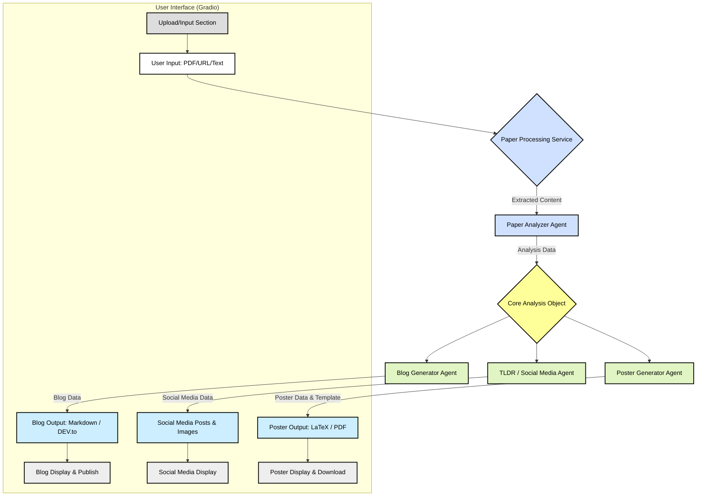

# 🎓 ScholarShare - AI-Powered Research Dissemination Platform

[](https://www.python.org/downloads/)
[](https://opensource.org/licenses/MIT)
[](http://makeapullrequest.com)
[](https://github.com/charliermarsh/ruff)
[](https://huggingface.co/Agents-MCP-Hackathon)

**ScholarShare** is an innovative platform designed to bridge the gap between complex academic research and broader public understanding. It leverages cutting-edge AI to transform dense research papers into accessible and engaging content formats, including blog posts, social media updates, and conference posters. Our goal is to empower researchers to maximize the impact of their work and foster a more informed society. 🚀

## ✨ Features

*   📄 **Multi-Format Paper Ingestion:** Upload PDFs, provide URLs (e.g., arXiv links), or paste raw text.
*   🧠 **In-Depth AI Analysis:** Extracts key information: title, authors, abstract, methodology, findings, results, conclusion, complexity, and technical terms.
*   📝 **Automated Blog Generation:** Creates beginner-friendly blog posts from research papers, complete with title, content, tags, and estimated reading time.
*   📱 **Social Media Content Creation:** Generates platform-specific content (LinkedIn, Twitter, Facebook, Instagram) including text posts and relevant images.
*   🎨 **Academic Poster Generation:** Produces LaTeX-based conference posters with customizable templates (IEEE, ACM, Nature) and orientations (landscape, portrait).
*   📊 **Presentation Generation:** Creates Beamer LaTeX presentations with customizable templates (academic, corporate, minimal) and adjustable slide counts (8-20 slides).
*   🚀 **Direct Publishing (DEV.to):** Seamlessly publish generated blog content to DEV.to as drafts or immediately.
*   📥 **Downloadable Outputs:** All generated content (analysis summaries, blog posts, LaTeX code, PDFs) can be easily downloaded.
*   🌐 **User-Friendly Interface:** Built with Gradio for an intuitive and interactive experience.

## 🛠️ Tech Stack

*   🐍 **Backend:** Python
*   🤖 **AI/ML:** Various LLM services (via `app.services.llm_service`)
*   🖼️ **Web Framework/UI:** Gradio (`gradio`, `gradio-pdf`)
*   📄 **PDF Processing:** `pdf_service` (details depend on implementation, e.g., PyMuPDF, pdfminer)
*   📜 **LaTeX Compilation:** (Assumed, for poster generation, e.g., `pdflatex` via `poster_service`)
*   🔗 **API Integration:** DEV.to API (via `devto_service`)
*   📦 **Packaging:** Poetry (implied by `pyproject.toml` and `uv.lock`)

## 🌊 Architecture & Workflow

ScholarShare processes research papers through a series of AI agents and services to generate various content formats.



## 📁 Project Structure

A high-level overview of the ScholarShare project directory.

```mermaid
graph TD
    R[ScholarShare Root]
    R --> F1[scholarshare/]
    R --> F2[1706.03762v7.pdf]
    R --> F3[README.md]
    R --> F4[requirements.txt]
    R --> F5[pyproject.toml]
    R --> F6[Dockerfile]
    R --> F7[docker-compose.yml]

    F1 --> S1[main.py Gradio App]
    F1 --> S2[app/]
    F1 --> S3[data/]
    F1 --> S4[outputs/]
    F1 --> S5[parsed_pdf_content.txt]

    S2 --> A1[agents/]
    S2 --> A2[config/]
    S2 --> A3[database/]
    S2 --> A4[models/]
    S2 --> A5[services/]
    S2 --> A6[templates/]
    S2 --> A7[utils/]

    A1 --> AG1[paper_analyzer.py]
    A1 --> AG2[blog_generator.py]
    A1 --> AG3[tldr_generator.py]
    A1 --> AG4[poster_generator.py]

    A5 --> SV1[pdf_service.py]
    A5 --> SV2[llm_service.py]
    A5 --> SV3[devto_service.py]
    A5 --> SV4[poster_service.py]

    %% Light styles for dark mode visibility
    style R fill:#ffffff,stroke:#000,stroke-width:2px,color:#000
    style F1 fill:#e8f0fe,stroke:#000,stroke-width:1.5px,color:#000
    style F2 fill:#f9f9f9,stroke:#000,stroke-width:1px,color:#000
    style F3 fill:#f9f9f9,stroke:#000,stroke-width:1px,color:#000
    style F4 fill:#f9f9f9,stroke:#000,stroke-width:1px,color:#000
    style F5 fill:#f9f9f9,stroke:#000,stroke-width:1px,color:#000
    style F6 fill:#f9f9f9,stroke:#000,stroke-width:1px,color:#000
    style F7 fill:#f9f9f9,stroke:#000,stroke-width:1px,color:#000
    style S1 fill:#f1f8e9,stroke:#000,stroke-width:1px,color:#000
    style S2 fill:#fff3e0,stroke:#000,stroke-width:1px,color:#000
    style S3 fill:#f1f8e9,stroke:#000,stroke-width:1px,color:#000
    style S4 fill:#f1f8e9,stroke:#000,stroke-width:1px,color:#000
    style S5 fill:#f1f8e9,stroke:#000,stroke-width:1px,color:#000
    style A1 fill:#ffe0b2,stroke:#000,stroke-width:0.5px,color:#000
    style A2 fill:#ffe0b2,stroke:#000,stroke-width:0.5px,color:#000
    style A3 fill:#ffe0b2,stroke:#000,stroke-width:0.5px,color:#000
    style A4 fill:#ffe0b2,stroke:#000,stroke-width:0.5px,color:#000
    style A5 fill:#ffe0b2,stroke:#000,stroke-width:0.5px,color:#000
    style A6 fill:#ffe0b2,stroke:#000,stroke-width:0.5px,color:#000
    style A7 fill:#ffe0b2,stroke:#000,stroke-width:0.5px,color:#000
    style AG1 fill:#fff,stroke:#000,stroke-width:0.5px,color:#000
    style AG2 fill:#fff,stroke:#000,stroke-width:0.5px,color:#000
    style AG3 fill:#fff,stroke:#000,stroke-width:0.5px,color:#000
    style AG4 fill:#fff,stroke:#000,stroke-width:0.5px,color:#000
    style SV1 fill:#fff,stroke:#000,stroke-width:0.5px,color:#000
    style SV2 fill:#fff,stroke:#000,stroke-width:0.5px,color:#000
    style SV3 fill:#fff,stroke:#000,stroke-width:0.5px,color:#000
    style SV4 fill:#fff,stroke:#000,stroke-width:0.5px,color:#000

```



## 🚀 Getting Started

### 📋 Prerequisites

*   Python 3.10+
*   Poetry (for dependency management - recommended) or pip
*   Access to a LaTeX distribution (e.g., TeX Live, MiKTeX) for poster generation.
*   (Optional) Docker 🐳

### ⚙️ Installation

1.  **Clone the repository:**
    ```bash
    git clone https://github.com/your-username/ScholarShare.git # Replace with actual repo URL
    cd ScholarShare
    ```

2.  **Set up environment variables:**
    Create a `.env` file in the `scholarshare/app/config/` directory or directly in `scholarshare/` if `settings.py` is configured to look there.
    Populate it with necessary API keys and configurations (e.g., `OPENAI_API_KEY`, `DEVTO_API_KEY`).
    Example `scholarshare/app/config/.env` (or `scholarshare/.env`):
    ```env
    OPENAI_API_KEY="your_openai_api_key"
    DEVTO_API_KEY="your_devto_api_key"
    # Other settings from settings.py
    HOST="0.0.0.0"
    PORT=7860
    DEBUG=True
    ```
    *(Ensure `settings.py` loads these, e.g., using `python-dotenv`)*

3.  **Install dependencies:**

    *   **Using UV (recommended):**
        ```bash
        uv sync
        ```

    *   **Using pip and `requirements.txt`:**
        ```bash
        pip install -r requirements.txt
        ```
        *(Note: `requirements.txt` might need to be generated from `pyproject.toml` if not kept up-to-date: `poetry export -f requirements.txt --output requirements.txt --without-hashes`)*

4.  **Ensure output directories exist:**
    The application creates these, but you can pre-create them:
    ```bash
    mkdir -p scholarshare/outputs/posters
    mkdir -p scholarshare/outputs/blogs
    mkdir -p scholarshare/data
    ```

### ▶️ Running the Application

*   **Using UV:**
    ```bash
    cd scholarshare
    uv run main.py
    ```

*   **Using Python directly:**
    ```bash
    cd scholarshare
    python main.py
    ```

The application will typically be available at `http://localhost:7860` or `http://0.0.0.0:7860`.

### 🐳 Running with Docker (if `Dockerfile` and `docker-compose.yml` are configured)

1.  **Build the Docker image:**
    ```bash
    docker-compose build
    ```
2.  **Run the container:**
    ```bash
    docker-compose up
    ```
    The application should be accessible as configured in `docker-compose.yml`.

## 📖 Usage

1.  **Navigate to the "Paper Input & Analysis" Tab:**
    *   **Upload PDF:** Click "Upload PDF Paper" and select your research paper.
    *   **Enter URL:** Paste a direct link to a PDF (e.g., an arXiv abstract page URL might work if the service can resolve it to a PDF, or a direct PDF link).
    *   **Paste Text:** Copy and paste the raw text content of your paper.
2.  **Analyze Paper:** Click the "🔍 Analyze Paper" button. Wait for the status to show "✅ Paper processed successfully!". The analysis summary will appear.
3.  **Generate Blog Content:**
    *   Go to the "📝 Blog Generation" tab.
    *   Click "✍️ Generate Blog Content". The generated blog post will appear.
    *   You can download it as Markdown.
4.  **Generate Social Media Content:**
    *   Go to the "📱 Social Media Content" tab.
    *   Click "📱 Generate Social Content". Content for LinkedIn, Twitter, Facebook, and Instagram will be generated, along with associated images if applicable.
5.  **Generate Poster:**
    *   Go to the "🎨 Poster Generation" tab.
    *   Select a "Poster Template Style" (e.g., IEEE, ACM).
    *   Select "Poster Orientation" (landscape or portrait).
    *   Click "🎨 Generate Poster". A PDF preview and LaTeX code will be displayed. You can download both.
6.  **Generate Presentation:**
    *   Go to the "📊 Presentation Generation" tab.
    *   Select a "Presentation Template Style" (academic, corporate, minimal).
    *   Adjust the "Number of Slides" (8-20 slides).
    *   Click "📊 Generate Presentation". A PDF preview and Beamer LaTeX code will be displayed. You can download both.
7.  **Publish to DEV.to:**
    *   Go to the "🚀 Publishing" tab (ensure blog content is generated first).
    *   Click "💾 Save as Draft" or "🚀 Publish Now". The status of the publication will be shown.

## 🖼️ Demo Video

[](https://youtu.be/GByo_w_9D-Q)

> **Watch our platform in action!** This demo showcases how ScholarShare transforms complex research papers into accessible content formats using AI-powered agents.

## 🤝 Contributing

Contributions are welcome! Whether it's bug fixes, feature enhancements, or documentation improvements, please feel free to:

1.  **Fork the repository.**
2.  **Create a new branch:** `git checkout -b feature/your-feature-name` or `bugfix/issue-number`.
3.  **Make your changes.** Ensure your code follows the project's style guidelines (e.g., run `black .` for formatting).
4.  **Write tests** for new features or bug fixes if applicable.
5.  **Commit your changes:** `git commit -m "feat: Describe your feature"` or `fix: Describe your fix`.
6.  **Push to the branch:** `git push origin feature/your-feature-name`.
7.  **Open a Pull Request** against the `main` (or `develop`) branch.

Please provide a clear description of your changes in the PR.

## 📜 License

This project is licensed under the **MIT License**. See the [LICENSE](LICENSE.md) file for details.

## 📞 Contact & Support

*   **Issues:** If you encounter any bugs or have feature requests, please [open an issue](https://github.com/your-username/ScholarShare/issues) on GitHub. <!-- Replace with actual repo URL -->
*   **Maintainer:** [Anurag Deo]<!-- Update with actual contact -->

## 🙏 Acknowledgements

*   The [Gradio](https://www.gradio.app/) team for the easy-to-use UI framework.
*   Providers of the LLM services used for content generation.
*   The open-source community for the various libraries and tools that make this project possible.

---
